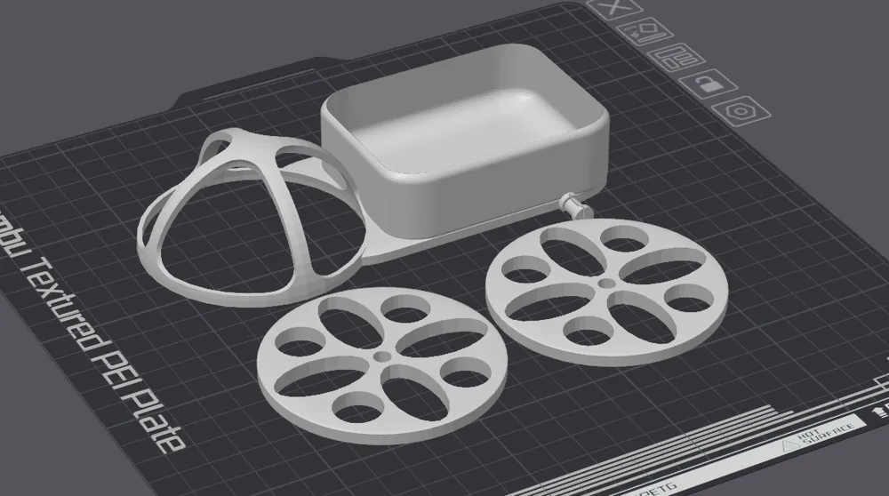
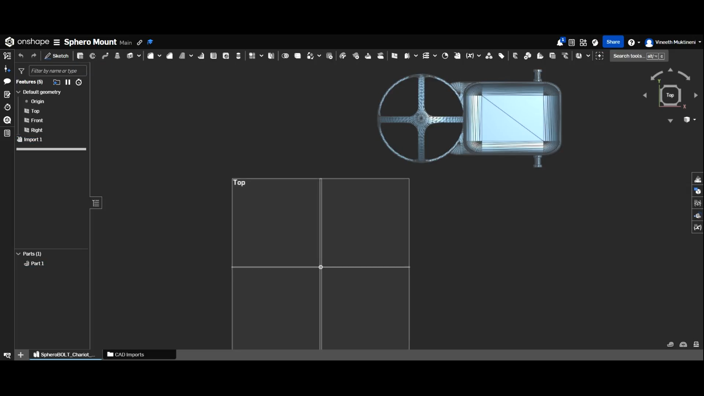
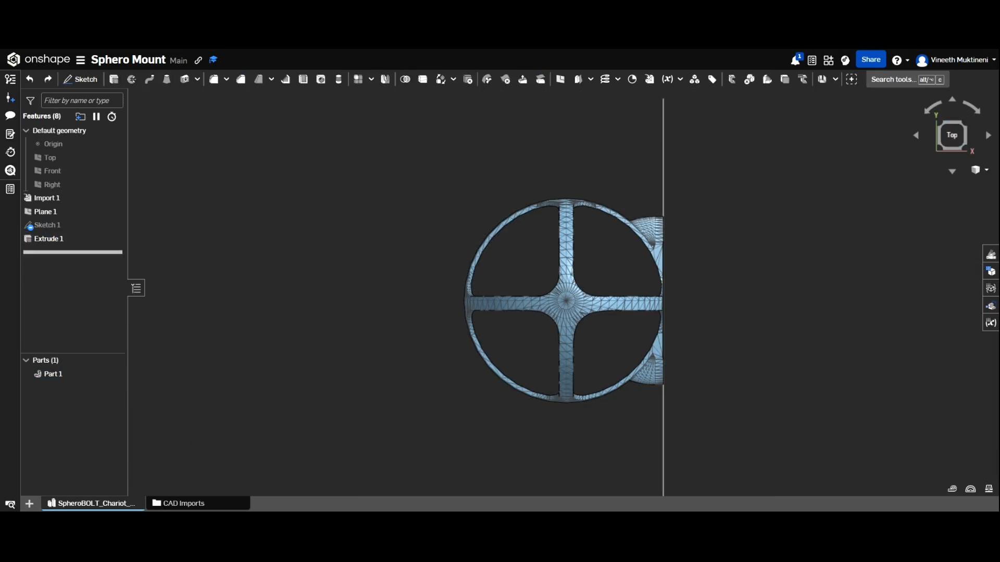
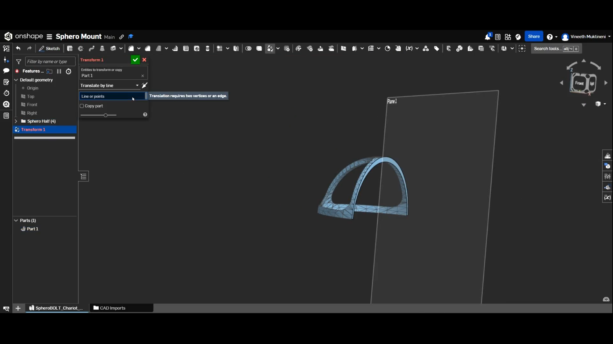
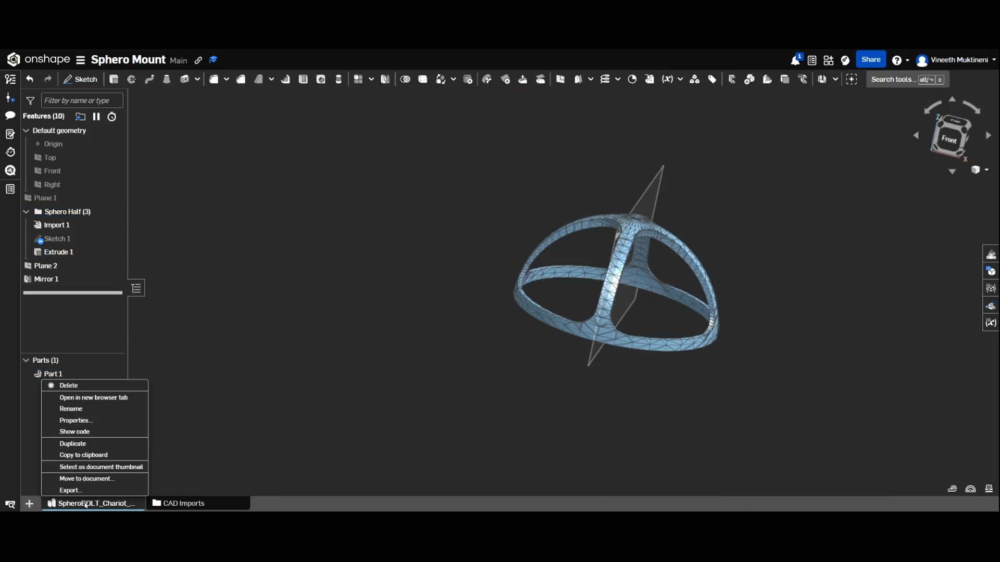

## Day 1 - Starting The Project - July 16th - 53 seconds

I spent wayyy longer than 53 seconds on this part but lapse only recorded 53 seconds so whatever thats what i'll go with i guess.

Today I decided that I wanted to build a mount for my sphero bolt so that I can mount things onto it later on. 
I have no experience with any CAD tools, so I'm basically jumping into the deep end. 
I started on Bambu Studios where I found a pre-existing model for a "Sphero Chariot" as they called it, With a few modifications I could probably get it to look like what I wanted. So I imported the model to Bambu Studio.

Here is the original model by @robotcrazy on Maker World:

Then I exported the model and imported it into onshape. I chose onshape because FreeCAD looked way too complicated and intimidating.

Then I spent a bunch of time trying to figure out how to use planes in onshape but eventually got it working

Then I removed the entire chariot part of the 3d model while keeping the mount:

Then I realized that it would be much neater to remove until the center of the mount and then mirror the half:

Now I'm going to import it into bambu studio and print the model to check if it fits on my sphero bolt. 

[Lapse Link](https://lapse.hackclub.com/timelapse/MJKbPos28L_9)