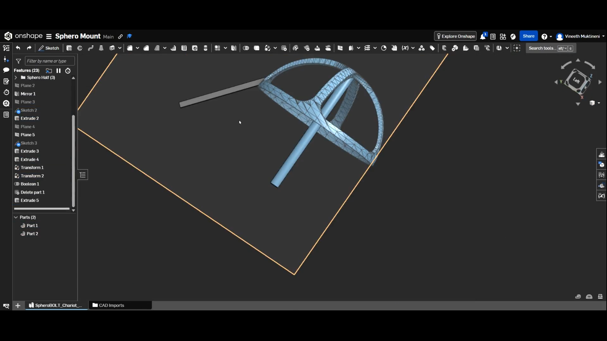
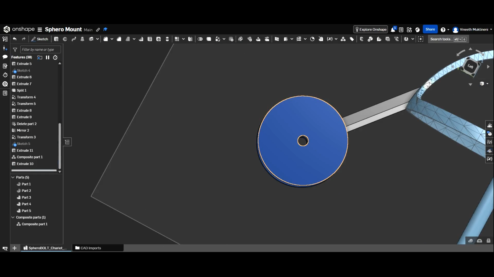
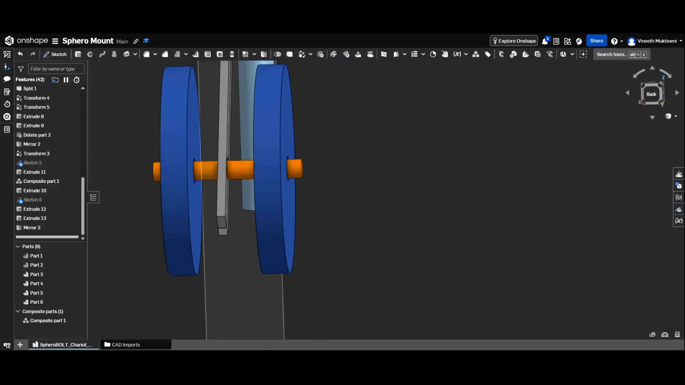
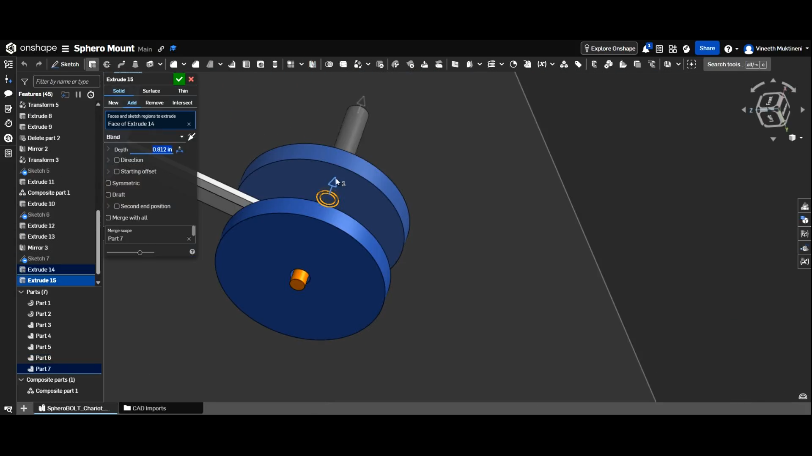
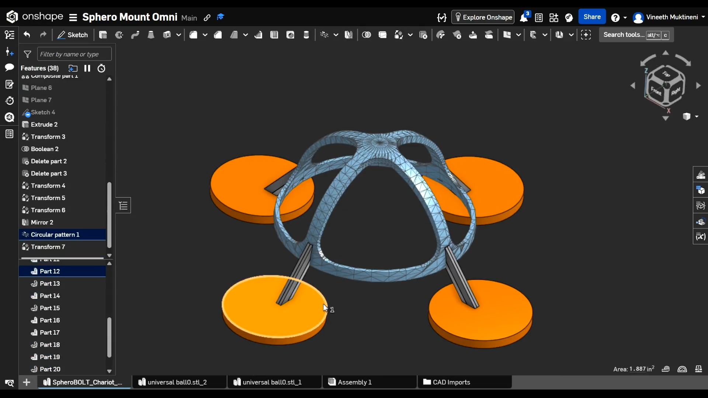
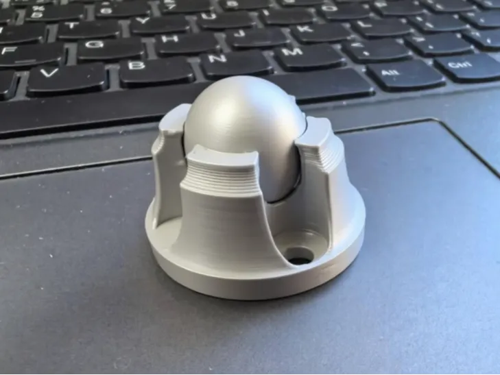
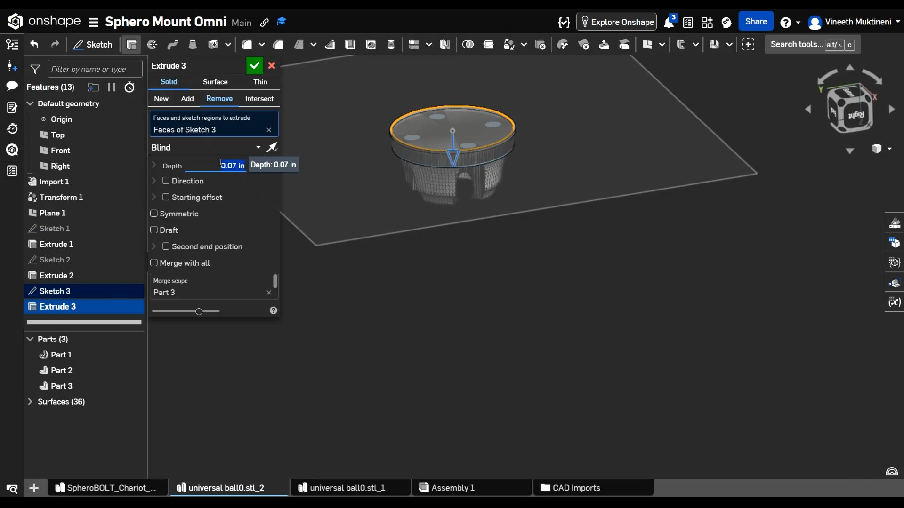

## Day 1 - Starting The Project - July 16th - 55 minutes

~~ I spent wayyy longer than 53 seconds on this part but lapse only recorded 53 seconds so whatever thats what i'll go with i guess. ~~
(Whoops I forgot it's a timelapse and not a full length recording lol) 

Today I decided that I wanted to build a mount for my sphero bolt so that I can mount things onto it later on. 
I have no experience with any CAD tools, so I'm basically jumping into the deep end. 
I started on Bambu Studios where I found a pre-existing model for a "Sphero Chariot" as they called it, With a few modifications I could probably get it to look like what I wanted. So I imported the model to Bambu Studio.

Here is the original model by @robotcrazy on Maker World:

Then I exported the model and imported it into onshape. I chose onshape because FreeCAD looked way too complicated and intimidating.

Then I spent a bunch of time trying to figure out how to use planes in onshape but eventually got it working

Then I removed the entire chariot part of the 3d model while keeping the mount:

Then I realized that it would be much neater to remove until the center of the mount and then mirror the half:

Now I'm going to import it into bambu studio and print the model to check if it fits on my sphero bolt. 

[Lapse Link](https://lapse.hackclub.com/timelapse/MJKbPos28L_9)

## Day 2 - Modifying the Mount - July 17th - 1 Hour 44 Minutes

I printed the model from yesterday:

and then today I decided to add a wheel to the mount so that it can move with the whole rig. 

I started by adding a extension to the main frame from yesterday. 

Then I added wheels to the extension.

Then I added the axel to complete the wheel system.

Here is how it looks after printing: 

I'll test it tomorrow. 

[Lapse Link](https://lapse.hackclub.com/timelapse/QUcXCIlbl9aW)

## Day 3 - Wheels + new frame - July 18th - 1 Hour 28 Minutes

After testing, I realized a major flaw with my design. When the sphero moved forward, the 3d printed frame would fall off. 

This was because the frame was losing balance and tipping over. 

To fix this I re-designed the frame to have four points of contact with the ground, ensuring that the frame could now balance with no issues. 

I then realized that using normal wheels would not cut it because the sphero can move in all directions. To solve this issue I needed to mount omni-directional wheels. After looking around I found this model by @user_2976285009 on Maker World: 

I modified the print to work with the frame I was modeling earlier (modifying the size and removing unnecessary holes.)

Then I printed both the frame and one of the wheels just to see if the model would fit and work properly.

However, after printing, the wheel would not turn at all even after applying lubricant and the circles at the bottom of the frame fell off without any force being applied. 

I'll change the model and the wheel design for next print.

[Lapse Link](https://lapse.hackclub.com/timelapse/eSOhsH2oCFgG)